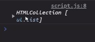

# DOM 1  
DOM (Document Object Model)  
DOM adalah jembatan supaya bahasa pemograman dapat berinteraksi dengan dokumen HTML  
DOM bukanlah bagian dari Javascript, melainkan browser (Web API)  

  

 

Cara kita mengambil data yang dimasukkan ke dalam adalah menggunakan DOM  
DOM akan membuat struktur pohon, standar untuk mengakses dokumen  
DOM adalah programming interface  
DOM dapat digunakan untuk pemograman yang lain  
Cara mengakses DOM yang berbeda  
DOM adalah API, semua bahasa oemograman bisa mengakses 

  

 

 

Setelah dimuat di load maka akan berbentuk menjadi DOM  
Mengakses DOM dapat menggunakan Javascript  
DOM tidak dapat digunakan pada server  

 

**Element**  
* Cuma HTML element  
* </ span />, </ div /> 

 

**Node**  
* Setiap bagian terkecil di HTML  
* Text, Comment,  
* Seperti teks, comment  

Ini adalah node  

 

 

### Traversering  
Trafersering adalah menjelajahi HTML  

   

Contoh Penggunaan   

  

Setelah di console.log  

   

mengakses di console.log  

  

 

Mengakses DOM di javascript  

  

jikalau ingin melihat document di console.log  

  

 

Dapat juga menggunakan class name  

  

Ket : Pada baris ke 7  

Setelah di console.log  

  

Hasilnya HTML collection karena namanya get elements (yang berarti lebih dari 1)  

 

Menggunakan by class  

  

Hasil di console.log  

