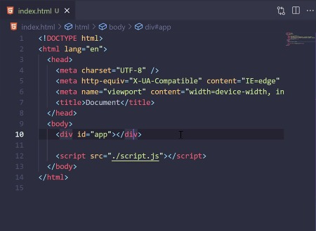
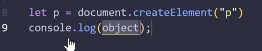
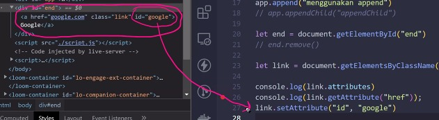
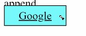

# DOM 2  
**Memanipulasi DOM**  

Buatlah file HTML terlebih dahulu

  

Cara mengakses elemen dengan DOM  
Dapat menggunakan nama tag, querry selector, dan dapat juga menggunakan ID  

  

>masukkan id nya  

  

>lalu console.log  

  

>sehingga di console.log seperti ini  

Dengan bantuan DOM, javascript mampu mengakses, mengubah dan memanipulatif struktur HTML  

   

>penggunaan inner HTML  

  

>penggunaan inner text  

Di dalam inner text tag tetap terbaca, sedangkan di inner HTML tag HTML dapat digunakan (dapat menyisipkan tag HTML).  

 

    

>div kosong di HTML dapat dimanipulasi oleh dom  

 

**Memanipulasi dapat menggunakan**

  

Contoh penggunaan :  

  

>DOM buatin element paragraf  

  

>sehingga di console.log ada p  

 

Pemakaian append  

  

>pemakaian append  

    

>Buat element terlebih dahulu kemudian isi dengan text, kemudian sisipkan dengan append  

Mengapa menggunakan HTML kosong karena mereka menggunakan single page application dimana halaman akan disisipkan ke id tadi  
Sehingga tidak ada refresh

  

>contoh penyisipan    

appenChild  
appendChild hanya bisa menyisipkan node  

  

>appenChild tidak bisa mengakses string  

  

>appenChild hanya bisa menerima node  

   

>untuk me remove  

  

>awalnya ada di console.log  

  

>sudah hilang  

  

Jika di HTML ada href a untuk link, maka di javascripr ada   

  

   

>di console.log dapat atribut href dan class  

  

>bentukan di HTML  

  

>untuk melihat atributnya  

  

>di console.log dapat google.com karena di HTML dibuat link google  

   

>penjelasan lebih rinci  

 

**Membuat Warna**  

  

  

>hasilnya  

 

**Membuat padding**  

  

Untuk melihat style nya apa aja  

  

   

>Yang make class link  
>index 0 nya karena get element by class name, mengembalikan sebuah nilai dalam bentuk HTML  
>collection mirip array, getsElement banyak element yang dikembalikan  
>Pada baris 29-30 : DOM buatin style pada link yang didapat tadi  

   

>maka hasilnya akan seperti ini  

  

>pada baris 26 terdapat google  
>pada baris 27 : pada link ini tolong tambahkan atribut id yang isinya google  

   

>baris 34 : meminta yang memiliki ud tess  

   

>tess uda di styling di HTML  

Pengen diambil dari DOM  

   

>maka dicek, meminta tolong ke DOM, ambil style di tess tadi  
>disimpan ke var, agar tidak panjang ketika mengambil height  

  

>di 36 disimpan style nya pada var, kemudian dapat diubah di dom lebih mudah pada baris 37  

  

>membuat paragraf di DOM  

   

>memberi style bisa langsung di javascript  

   

>dapat membuat element juga