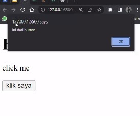

# DOM 3  
**Interaksi User (Events)**  
User experience bbersifat dua arah : selain menampilkan HTML, halaman web juga harus bisa menangkap interaksi user.  
Atau bisa juga disebut events adalah kejadian/kegiatan/interaksi yang terjadi pada website  
Ketika user mengarahkan mousenya ke arah yang lain ketika berinteraksi dengan sebuah element.

 

**Events**  
* click  
* submit  
* focus  
* blur  
* hover  
* change  
* scroll  

 

**Tiga cara memberikan event**  
* HTML attribute  
* event propperty  
* addEventListener()  

 

  

>jangan lupa tambahkan defer  

  
> buat file HTML dlu  

 

#### Cara 1  :  

  

  

>artinya h1 bisa dkilik dan dia akan menjalankan sesuatu, ternyata dia akan menjalankan alert dengan tulisan selamat datang  
>onclick bisa benntuk apapaun, bisa tulisan atau apapapun  

  

>akan muncul  

 

**Event Types**  

  

   

Hover  

  

  

>muncul ketika diarahkan ke element  

 

#### Cara 2  

  

>di HTML  

  

>ambil id nya  

  

>bisa memasukkan function  

  

>bentukan di website  

  

>dapat juga begini  

   

>di web muncul alert  

 

#### Cara 3  

  

>di HTML  

  

>atau bisa juga begini  

   

>muncul ketika klik saya ditekan  

   

>tampilan Javascript lebih jelas  

   

>tampilan HTML lebih jelas  

   

**Dua cara menghandle event**  
* adevenetlistener  
* property atau secara inline  

Perbedaannya :  
Kita bisa menambhakan multiple handler utk event yg menggunakan adeventlistener.  
Bisa lbh dr 1 handler  

**Penggunaan addevenetlistener menghandle event**  

  

>th lebih dari 1  

  

>dua-duanya jalan  

Jikalau penggunaan onclik  

  

>ternyata tidak bisa menjalankan keduanya  

  

>ketika diclik, maka console.log akan ada penggunaan event.target