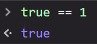

# Data Type Built in Prototype & Method
**Tipe Data Primitif**  
* String
* Number
* Boolean  
Primitif artinya tipe data yang masih standart.

**Tipe Data Non-Primif**  
* Array
* Object  
Non-primitif artinya tipe data yang sudah dikembangkan.

 

Javascript adalah bahasa pemograman dinamis.  
Artinya tidak ada peraturan yang ketat.  
Tyscript merupakan typesave utk javascript.
Penggunaannya adalah takutnya jika var diganti2 bisa diatasi dengan type script.  
Typeof : utk mngecek tipe data.  
Dapat juga digunakan untuk perbandingan.  
Contoh penggunaaan :  

  

 

Untuk mengetahui karakter di dalam string dapat menggunakan length.  

  

 

Properties : ciri-ciri dari string tsb, semisal brp banyak karakter.  

Cara menyisipkan variabel ke dalam string dapat dilakukan dengan 2 cara :  
* memasukkan let  
* dapat juga menggunakan ${}  

 

Method : keahlian/ function   
Method diakhiri dengan () 

 

**Penggunaan toUpperCase**  
Membuat tulisan huruf besar semua.

  

Maka tulisannya kaan seperti ini :  

 

 

**Penggunaan toLowwerCase**  
Membuat tulisan menjadi huruf kecil semua.  

 

 

**Penggunaan chartAt**  
charAt akan mengambilan sebuah karakter berdasarkan posisi index yg ditentukan.  
Contoh penggunaan :  

  

Minta index ke 1  

  

Maka akan muncul A  

 

**Penggunaan includes**  
Includes untuk melakukan pencarian, yg dikembalian adalah true/false.  

  

Contoh penggunaan  

  

Maka hasilnya akan true karena ada  

 

  

 

**Penggunaan Split**  
Split memisahkan sebuah string menjadi data array  
Contoh penggunaan split  

  

Hasil di console.log

 

 

**Built-in-Method**  

  

 

**Cara for jika tidak ingin menggunakaan include**  
Includs sensitive terhadap huruf besar dan huruf kecil.  
Contoh kesensitivan  :

  

 

### Method Number  
Properties merupakan sebuah nilai/ciri-ciri  
Method adalah sebuah kemampuan

 

**NaN**  
Penggunaan isNaN  
NaN adalah Not a Number

  

Penjelasan : Apakah "halo" adalah bukan angka? Sehingga jawabannya true  
Namun jika data adalah boolean maka jawabannya adalah false  

  

Jika memasukkan angka dan boolean maka dia akan false  
Boolean dianggap false karena, true adalah 1, false adalah 0  
Karena mereka adalah angka maka akan false  

  

 

**Penggunaan toString**  
Mengubah number menjadi sebuah string  
Contoh penggunaan

  

Trik lain agar number menggunakan string   

  

 

**Penggunaan toFix**  
toFix dapat menentukan angka beraoa di belakang koma  

Penggunaan yang di dalam kurung berapa angka di belakang koma  

  

Yang dihasilkan adalah angka di dalam string  

Membuat number tetap menjadi number  

  

 

**Penggunaan Math**  
Penggunaan math adalah menghasilkan data-data yang sudah ada, semisal yang uda ada di sebelumnya.  

  

math.abs akan mengembalikan nilai absolut yang bulat 

  

math.pow : pangkat  

  

math.sqrt : akar  

  

math.crt : akar pangkat 3  

math.round : koma akan dihilangkan  

  

math.floor : akan dibulatkan ke bawah  

   

math.ceil : pembulatan ke atas  

  

math.random : memunculkan angka acak  

  

 

### Prototype  
Mekanisme javascript object mampu menurunkan 1 fitur ke fitur lain  
String apapun yang digunakan sudah ada method  
Di Prototype bisa menambahkan method  
Contoh pengembalian sebuah string dengan huruf pertama di belakang-huruf terakhir ke depan  

  

hasilnya  

  

 

**Object Literal**  

  

Tidak bisa ditambhkan tom age karena bentuk datanya const  

