# Function  
Function adalah sebuah blok kode dalam sebuah group untuk menyelesaikan 1 task/1 fitur.  
Saat kita membutuhkan fitur tersebut nantinya, kita bisa kembali menggunakannya.  

Contoh kasus :  

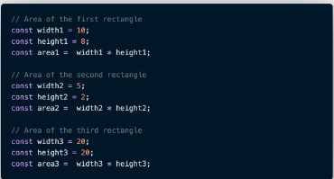  

Akan muncul sebuah masalah jika user meminta program untuk menghitung luas persegi panjang dari banyak soal. Tidak mungkin membuat code yang sebenarnya sama tapi dengan jumlah yang banyak berulang kali.  
Disinilah kita membutuhkan Function.  

 

### Membuat Function  

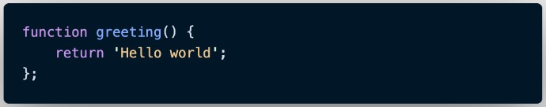  

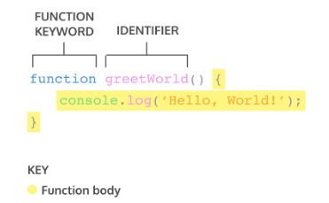  

 

### Memanggil Function  

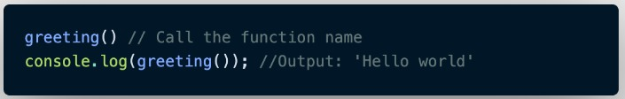  

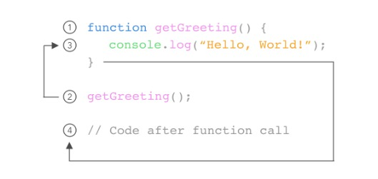  

 

### Parameter dan Argumen  

**Parameter Function**
* Dengan parameter function dapat menerima sebuah inputan data dan menggunakan untuk task/tugas  
* saat membuat function/fitur, kita harus tahu data-data yang dibutuhkan.  
Misalnya saat membuat function penambahan 2 buah nilau. Data yang dibutuhkan adalah 2 buah nilai tersebut.  

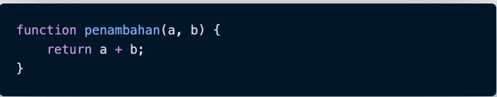  

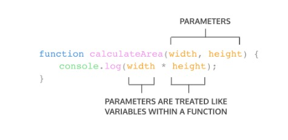  

 

**Argumen Function**
* Argumen adalah nilai yang digunakan saat memanggil function.  
* Jumlah argumen harus sama dengan jumlah parameternya.  
* Jadi jika di function penambahan ada 2 parameter nilai saat membuat function. Saat memanggil function kita gunakan 2 buah nilai argumen.  

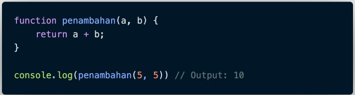  

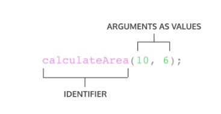  

 

Function sangat sangat dibutuhkan agar kita dapat dengan mudah memanage code dan tracing code jika ada error.  

 

### Default Parameters  
Default paramaters digunakan untuk memberikan nilai awal/default pada parameter function.  
Default parameters bisa digunakan jika kita ingin menjaga function agar tidak error saat dipanggil tanpa argumen.  

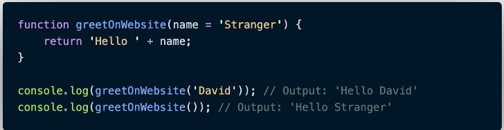  

 

### Function Helper  
Digunakan agar bisa menggunakan function yang sudah dibuat pada function lain.  

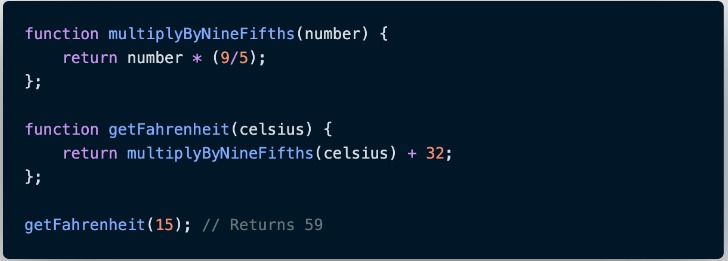  

 

### Arrow Function  
Arrow function adalah cara lain menuliskan function. Ini adalah fitur terbaru yang ada pada ES6 (Javascript Version).  

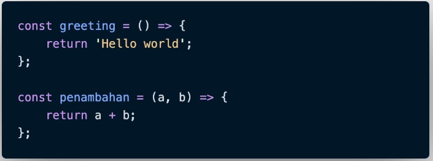  

### Short Syntax Function  

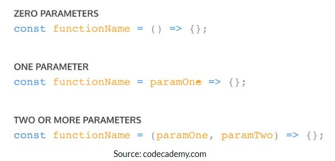  

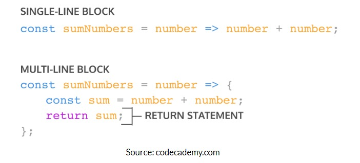  