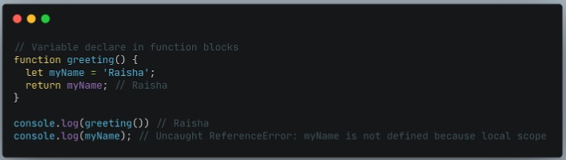

# Scope  
Scope adalah konsep dalam flow data variabel.  
menentikan suaru variabel bisa diakses pada diakses pada scope tertentu atau tidak.  

 

## Blocks  
Blocks adalah code yang berada di dalam curly braces.{}  
Conditional, function, dan looping menggunakan vlocks.  

 

## Global Scope  
Global scope berarti variabel yang kita buat dapat diakses dimanapun dalam suatu file.  
agara menjadi Global Scope, suatu variabel harus dideklerasikan di luar scope.  

  

 

## Local Scope  
Local Scope berarti kita mendeklarasikan variabel di dalam blocks seperti function, conditional, dan looping.  
Maka variabel hanya bisa diakses di dalam blocks saja. Tidak bis adiakses di luar blocks.  

